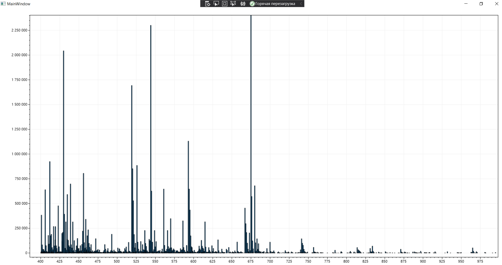
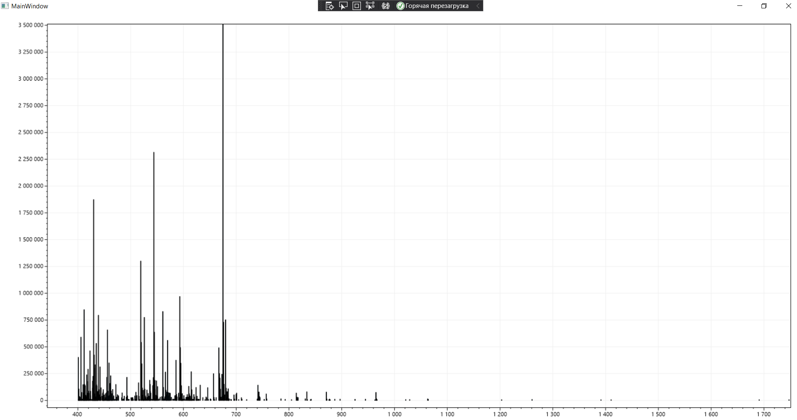
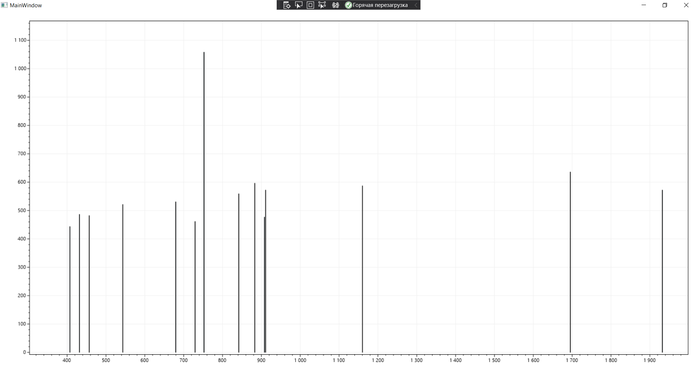

# MassSpectrumApp

## Description

A software project at the Saint-Petersburg University for the analysis of mass spectrum data. 

Студенческий проект. Разработака приложения для анализа данных UVPD-масс-спектров

## Output plots

## Sources

- К. В. Вяткина. De novo секвенирование белков и пептидов: алгоритмы, приложения, перспективы.
- Kira Vyatkina, Si Wu, Lennard J. M. Dekker, Martijn M. VanDuijn, Xiaowen Liu, Nikola Tolic, Mikhail Dvorkin, Sonya Alexandrova,Theo M. Luider, Ljiljana Pasa-Tolic and Pavel A. Pevzner. De Novo Sequencing of Peptides from Top-Down Tandem Mass Spectra 
- Xiaowen Liu, Yuval Inbar, Pieter C. Dorrestein, Colin Wynne, Nathan Edwards, Puneet Souda, Julian P. Whitelegge, Vineet Bafna and Pavel A. Pevzner. Deconvolution and Database Search of Complex Tandem Mass Spectra of Intact Proteins
- Huseyin Guner, Patrick L. Close, Wenxuan Cai, Han Zhang, Ying Peng, Zachery R. Gregorich and Ying Ge. MASH Suite: A User-Friendly and Versatile Software Interface for High-Resolution Mass Spectrometry Data Interpretation and Visualization. 

## Mentors

Vyatkina Kira Vadimovna

- kira.vyatkina@gmail.com
- [AU website](https://spbau.ru/ob-universitete/kafedryi/kafedra-bioinformatiki-i-matematicheskoj-biologii/pps/vyatkina-kira-vadimovna)

## Contacts

Klimenko Polina

- Telegram: @polinko13
